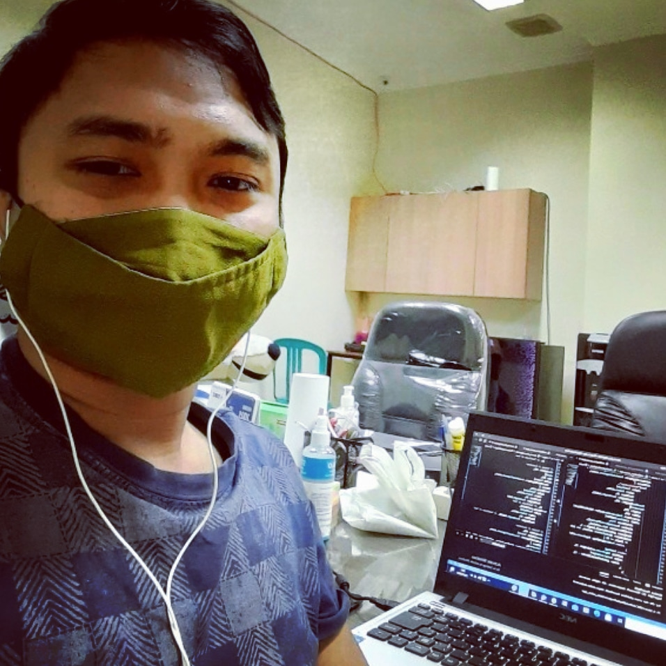

<html>
<title>Ditya Developer is here</title>
<meta charset="UTF-8">
<meta name="viewport" content="width=device-width, initial-scale=1">
<link rel="stylesheet" href="https://www.w3schools.com/w3css/4/w3.css">
<link rel='stylesheet' href='https://fonts.googleapis.com/css?family=Roboto'>
<link rel="stylesheet" href="https://cdnjs.cloudflare.com/ajax/libs/font-awesome/4.7.0/css/font-awesome.min.css">

<body class="w3-light-grey">

<!-- Page Container -->

  <!-- The Grid -->
  

  
    <!-- Left Column -->
    

    
      

        

          
          

            <h2><b>
Aditya Hermanto
</b></h2>
          

        

        

          
<i class="fa fa-briefcase fa-fw w3-margin-right w3-large w3-text-teal"></i>Mobile Apps Developer

          
<i class="fa fa-home fa-fw w3-margin-right w3-large w3-text-teal"></i>Jakarta Selatan, Indonesia

          
<i class="fa fa-envelope fa-fw w3-margin-right w3-large w3-text-teal"></i>hermanto.ditya@gmail.com

          
<i class="fa fa-phone fa-fw w3-margin-right w3-large w3-text-teal"></i>+62 812-9292-1433 <b>  or </b><a href="https://api.whatsapp.com/send?phone=6281292921433&text=Hello%20Ditya%20Developer." target="_blank"><i class="fa fa-whatsapp fa-fw w3-margin-right w3-xxlarge w3-text-teal"></i></a>

          

          
<b><i class="fa fa-asterisk fa-fw w3-margin-right w3-text-teal"></i>Skills</b>

          
Android SDK

          

            
90%

          

          
Figma

          

            

              
80%

            

          

          
MYSQL

          

            
80%

          

          
Git

          

            
80%

          

          
Firebase

          

            
80%

          

          
Construct

          

            
80%

          

           

          
<b><i class="fa fa-globe fa-fw w3-margin-right w3-text-teal"></i>Languages</b>

          
English

          

            

          

          
Bahasa Indonesia

          

            

          

           
        

      
 

    <!-- End Left Column -->
    

    <!-- Right Column -->
    

    
      

        <h2 class="w3-text-grey w3-padding-16"><i class="fa fa-suitcase fa-fw w3-margin-right w3-xxlarge w3-text-teal"></i>Employment History</h2>
        

          <h5 class="w3-opacity"><b>Mobile Developer / <a href="https://www.adoblako.com/" target="_blank">Ado Blako Celestial</a></b></h5>
          <h6 class="w3-text-teal"><i class="fa fa-calendar fa-fw w3-margin-right"></i>Aug 2020 - Current</h6>
         
          

        

        

          <h5 class="w3-opacity"><b>Mobile Developer / Muloska Pratama</b></h5>
          <h6 class="w3-text-teal"><i class="fa fa-calendar fa-fw w3-margin-right"></i>Nov 2019 - Feb 2020</h6>
         
          

        

        

          <h5 class="w3-opacity"><b>Mobile Developer / Ginting Tracking Sistem</b></h5>
          <h6 class="w3-text-teal"><i class="fa fa-calendar fa-fw w3-margin-right"></i>Aug 2018 - Aug 2019</h6>
         

        

      

      

        <h2 class="w3-text-grey w3-padding-16"><i class="fa fa-certificate fa-fw w3-margin-right w3-xxlarge w3-text-teal"></i>Education</h2>
        

          <h5 class="w3-opacity"><b>Bachelor of informatics engineering / Universitas Tama Jagakarsa</b></h5>
          <h6 class="w3-text-teal"><i class="fa fa-calendar fa-fw w3-margin-right"></i>2015 - 2019</h6>
          
Focus on mobile applications

          

        

        

          <h5 class="w3-opacity"><b>Technical Networking / Vocational High School Perguruan Cikini 3</b></h5>
          <h6 class="w3-text-teal"><i class="fa fa-calendar fa-fw w3-margin-right"></i>2012 - 2015</h6>
          
playing with networking and computer installation

          

        

      

       
      

        <h2 class="w3-text-grey w3-padding-16"><i class="fa fa-vcard fa-fw w3-margin-right w3-xxlarge w3-text-teal"></i>Personal Summary</h2>
        

          <h5 class="w3-opacity"><b>passionate native developer with 2+ years of experiences and track record of employment history. flutter framework and dart language is my favorites tools to development apps. i'll review the usecases to find solver with my logic and get the finish with my task.</b></h5>    
          

        

      
      

        
      

        <h2 class="w3-text-grey w3-padding-16"><i class="fa fa-space-shuttle fa-fw w3-margin-right w3-xxlarge w3-text-teal"></i>Company Project</h2>
         

          <h5 class="w3-opacity"><b>Klix Sales Agent Apps</b></h5>
           <a href="https://we.tl/t-oB72l565gy" target="_blank"><b>Link download</b></a>
          

          

       
        
 
      

       
      

        <h2 class="w3-text-grey w3-padding-16"><i class="fa fa-rocket fa-fw w3-margin-right w3-xxlarge w3-text-teal"></i>Personal Project</h2>
         

          <h5 class="w3-opacity"><b>Biznet</b></h5> 
           <a href="https://we.tl/t-JCnw6w2Ygm" target="_blank"><b>Link download</b></a>
          

        
 

        

          <h5 class="w3-opacity"><b>Kasku Warteg Bahari Tj Barat</b></h5> 
          <a href="https://we.tl/t-5GMM8P3WnV" target="_blank"><b>Link download</b></a>
          

        
  

         

          <h5 class="w3-opacity"><b>Go SJG apps</b></h5> 
          <a href="https://we.tl/t-dPLBXT1rGq" target="_blank"><b>Link download</b></a>
          

        
 

        

          <h5 class="w3-opacity"><b>Snow wash apps</b></h5> 
         <a href="https://we.tl/t-LDb38gtmUS" target="_blank"><b>Link download</b></a>
          

        
 

        

          <h5 class="w3-opacity"><b>Laundry apps</b></h5> 
         <a href="https://we.tl/t-7ptVMz3CcG" target="_blank"><b>Link download</b></a>
          

        

      

       
      

        <h2 class="w3-text-grey w3-padding-16"><i class="fa fa-gamepad fa-fw w3-margin-right w3-xxlarge w3-text-teal"></i>Game Project</h2>
         

          <h5 class="w3-opacity"><b>Tank DPS</b></h5> 
          <a href="https://dityadeveloper.github.io/tankdps.github.io/" target="_blank"><b>Play Game</b></a>
          

        
 

         

          <h5 class="w3-opacity"><b>Cutle bee</b></h5> 
          <a href="https://dityadeveloper.github.io/cutlebee.github.io/" target="_blank"><b>Play Game</b></a>
          

        
 

        

          <h5 class="w3-opacity"><b>Cannon Deffender</b></h5> 
           <a href="https://dityadeveloper.github.io/canondps.github.io/" target="_blank"><b>Play Game</b></a>
          

        
 
      

    <!-- End Right Column -->
    

    
  <!-- End Grid -->
  

  
  <!-- End Page Container -->

<footer class="w3-container w3-teal w3-center w3-margin-top">
  
<b>- TRY EVERYTHING TO GET ANYTHING -</b>

 
</footer>

</body>
</html>
